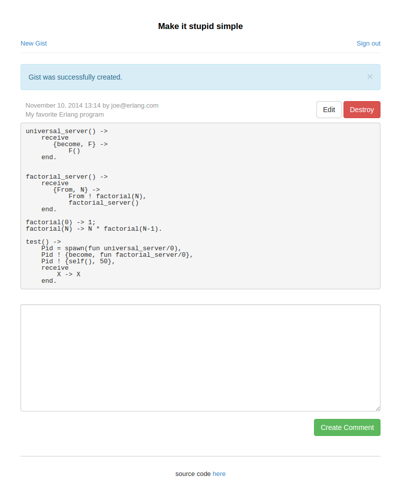
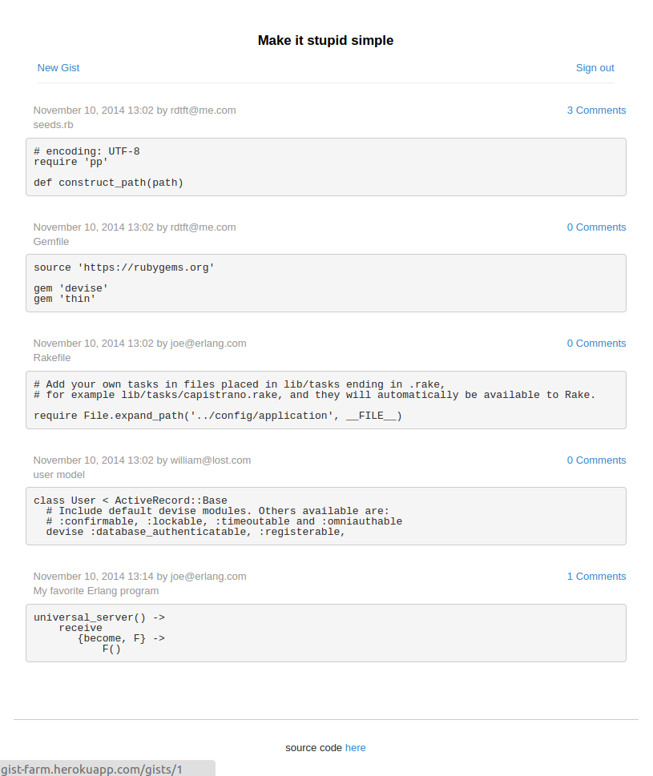

## Attempt to make a clone of gist.github.com

HOWTO Setup
---
```
  $ bundle
  $ rake db:create
  $ rake db:migrate
  $ rake db:seed
```

Demo [here](http://gist-farm.herokuapp.com/)
---
Test accounts:

|login|password|
|-----------------|-------------|
|rdtft@me.com     | foobarbaz   |
|joe@erlang.com   | spawn-foobar|
|william@lost.com | 24-foobarbaz|

Screenshots
---



